This is a repository containing common 3D test models in original format with original source if known. While a [similar list exists on wikipedia](https://en.wikipedia.org/wiki/List_of_common_3D_test_models), it does not host the actual models and is incomplete.

Please submit a [pull request](https://github.com/alecjacobson/common-3d-test-models/pulls) with new model data and sources!

Please submit an [issues](https://github.com/alecjacobson/common-3d-test-models/issues) with an image or .obj file of a "wanted" source/model.

## List of Common 3D Test Models

| Model Name | Image | Original File | ~10MB .obj | Source | First Known Appearance |
|------------|-------|---------------|------------|--------|--------|
| Armadillo | 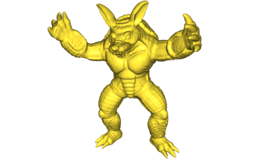 | [.zip](data/armadillo.zip) | [.obj](data/armadillo.obj) | [Stanford](http://graphics.stanford.edu/data/3Dscanrep/) | [dblp](https://dblp.uni-trier.de/rec/bibtex/conf/siggraph/KrishnamurthyL96) |
| Beast | 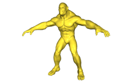| [.zip](data/beast.zip) | [.obj](data/beast.obj) | Autodesk | [dblp](https://dblp.uni-trier.de/rec/bibtex/journals/cgf/WeberSLG07) |
| Beetle | 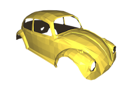 | missing*(quad mesh?) | [.obj](data/beetle.obj), [common alt .obj](data/beetle-alt.obj) | [Ivan Sutherland](https://blenderartists.org/t/ivan-sutherlands-1972-mesh/1162769) | missing |
| Cheburashka | 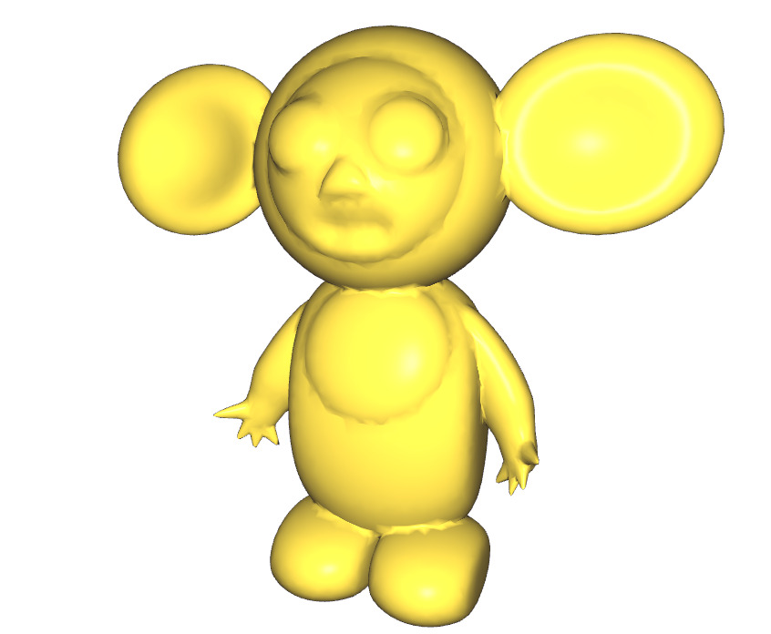 | [.zip](data/cheburashka.zip) | [obj](data/cheburashka.obj) | Ilya Baran(?) | [dblp](https://dblp.org/rec/bibtex/journals/tog/BaranP07) |
| Cow | 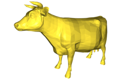 | [.zip](data/cow.zip) | [.obj](data/cow.obj) | [Viewpoint Animation Engineering / Sun Microsystems](https://gfx.cs.princeton.edu/proj/sugcon/models/) | [dblp](https://dblp.uni-trier.de/rec/bibtex/journals/tog/DeCarloFRS03) |
| Fandisk |  | [.m (Hoppe Mesh format)](data/fandisk.m) | [.obj](data/fandisk.obj) | CAD part Pratt & Whitney/Hughes Hoppe | [dblp](https://dblp.org/rec/conf/siggraph/HoppeDDHJMSS94.html) |
| Happy Buddha | 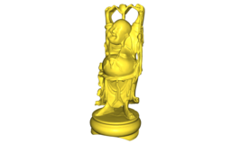 | [.zip](data/happy.zip) | [.obj](data/happy.obj) | [Stanford](http://graphics.stanford.edu/data/3Dscanrep/) | [dblp](https://dblp.uni-trier.de/rec/bibtex/conf/siggraph/CurlessL96) |
| Horse | 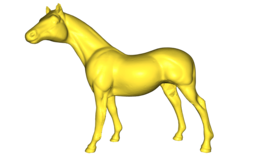 | [.zip](data/horse.zip) | [.obj](data/horse.obj) | [CyberWare](http://web.archive.org/web/20010126102500/https://www.cc.gatech.edu/projects/large_models/horse.html) | [dblp](https://dblp.uni-trier.de/rec/bibtex/conf/siggraph/PraunFH00) |
| Max Planck | 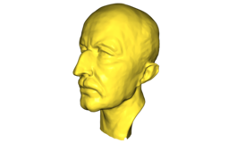 | missing ([not full res?](https://gfx.cs.princeton.edu/proj/sugcon/models/)) | [.obj](data/max-planck.obj) | [MPI](https://gfx.cs.princeton.edu/proj/sugcon/models/) | missing |
| Nefertiti | 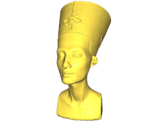 | [.zip](data/nefertiti.zip),[.z01](data/nefertiti.z01),[.z02](data/nefertiti.z02),[.z03](data/nefertiti.z03),[.z04](data/nefertiti.z04) | [.obj](data/nefertiti.obj) | [Berlin Egyptian Museum](https://www.thingiverse.com/thing:3974391) | missing |
| Ogre | 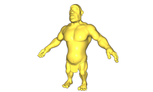 | [.zip](data/ogre.zip) | [.obj](data/ogre.obj) | Kiaran Ritchie | [dblp](https://dblp.uni-trier.de/rec/bibtex/journals/tog/LipmanLC08) |
| Rocker Arm |  | [.zip](data/rocker-arm.zip)* | [.obj](data/rocker-arm.obj) | [INRIA](http://visionair.ge.imati.cnr.it:8080/ontologies/shapes/search.jsp)* (does scan data exist?) | missing |
| Spot | 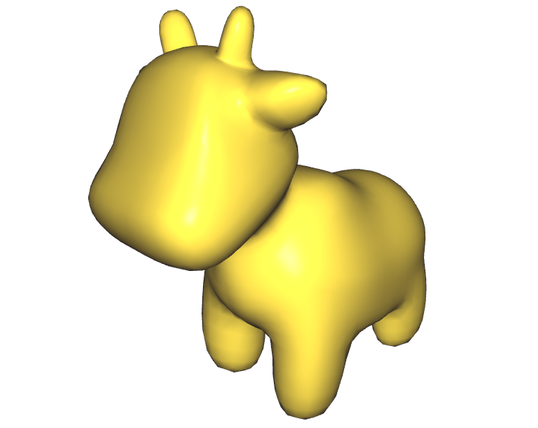 | [.zip](data/spot.zip) | [.obj](data/spot.obj) | [Keenan Crane](https://www.cs.cmu.edu/~kmcrane/Projects/ModelRepository/#spot) | missing |
| Stanford Bunny | 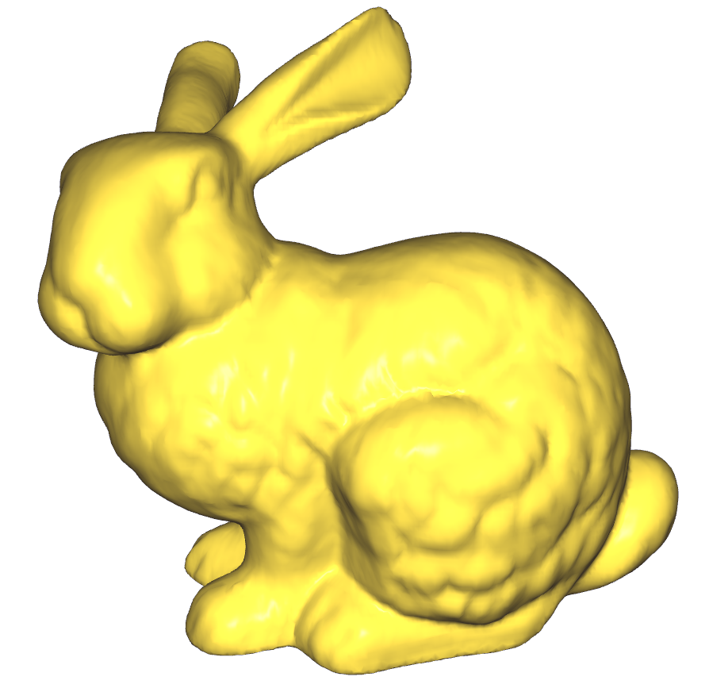 | [.zip](data/stanford-bunny.zip) | [.obj](data/stanford-bunny.obj) | [Stanford University](http://graphics.stanford.edu/data/3Dscanrep/) | [dblp](https://dblp.uni-trier.de/rec/bibtex/conf/siggraph/TurkL94)
| Suzanne | 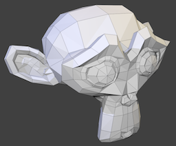 | [.zip](data/suzanne.zip) | [.obj](data/suzanne.obj) | Blender | missing |
| Teapot |  | [.zip](data/teapot.zip) | [.obj](data/teapot.obj) | [Martin Newell](ftp://ftp.funet.fi/pub/sci/graphics/packages/objects/teaset.tar.Z) | missing |
| XYZ Dragon |  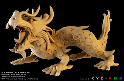  |  [.zip](data/xyzrgb_dragon.zip)  |  [.obj](data/xyzrgb_dragon.obj)  | [Stanford](http://graphics.stanford.edu/data/3Dscanrep/)  | missing |
| Alligator |  | [.zip](data/alligator.zip) | [.obj](data/alligator.obj) | [Alec Jacobson](http://www.cs.toronto.edu/~jacobson/images/alec-jacobson-thesis-2013.pdf) | [dblp](https://dblp.org/rec/bibtex/journals/tog/JacobsonBPS11)
| Woody/Gingerbread Man | 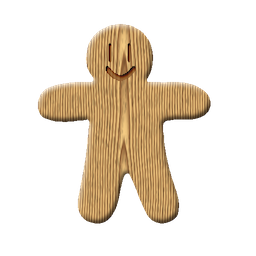 | [.zip](data/woody.zip) | [.obj](data/woody.obj) | Scott Schaefer | [dblp](https://dblp.org/rec/bibtex/journals/tog/SchaeferMW06) |
| Lucy | 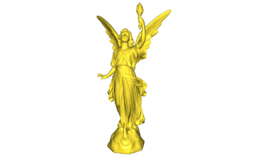  |  [.zip](data/lucy.zip),[.z01](data/lucy.z01),[.z02](data/lucy.z02),[.z03](data/lucy.z03),[.z04](data/lucy.z04) ,[.z05](data/lucy.z05)  |  [.obj](data/lucy.obj)  |  [Stanford University](http://graphics.stanford.edu/data/3Dscanrep/)  | missing |
| Bimba | missing | missing | missing | missing | missing |
| Igea | 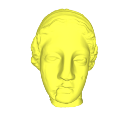 | [.zip](data/igea.zip) | [.obj](data/igea.obj) | Cyberware | missing |

# Other lists and repositories of 3D models

- [List](https://all3dp.com/best-sites-free-stl-files-3d-printing/) of websites offering collections of 3D models.
- [Thingiverse](http://www.thingiverse.com/)
- [thingi10k](https://ten-thousand-models.appspot.com)
- [GrabCAD](https://grabcad.com/library)
- [The Stanford 3D Scanning Repository](http://graphics.stanford.edu/data/3Dscanrep/)
- [Large Geometric Models Archive (Georgia Tech)](https://www.cc.gatech.edu/projects/large_models/)
- [Keenan's 3D Model Repository](http://www.cs.cmu.edu/~kmcrane/Projects/ModelRepository/)
- [McGuire Computer Graphics Archive](http://casual-effects.com/data/index.html)
- [3D Scans of Statues and Crabs](http://threedscans.com/)
- [3D Model Haven](https://3dmodelhaven.com/models/)
- [A Large Dataset of Object Scans](http://redwood-data.org/3dscan/index.html)
- [CAD Model Datasets](http://edge.cs.drexel.edu/repository/)
- https://www.shapenet.org/
- http://modelnet.cs.princeton.edu/
- https://www.themantissa.net/resources/
- https://archive3d.net/
- [Aim@Shape](http://visionair.ge.imati.cnr.it/ontologies/shapes/viewmodels.jsp)
- [Rendering Resources](https://benedikt-bitterli.me/resources/)
- [Human 3D Scans](https://ps.is.tuebingen.mpg.de/research_projects/faust-dataset)
- [USTC 20712 Dataset for Parameterizations](http://staff.ustc.edu.cn/~fuxm/projects/ProgressivePara/dataset.html)
- [USTC 5181 meshes](http://staff.ustc.edu.cn/~fuxm/projects/AHSP/index.html)
- [MPI Dynamic FAUST human bodies](http://dfaust.is.tue.mpg.de/)
 - [Facebook Reality Lab Replica](https://github.com/facebookresearch/Replica-Dataset)
- [Smithsonian Institution](https://www.si.edu/search/3d-models)
- [3D scans by artec](https://www.artec3d.com/3d-models)
